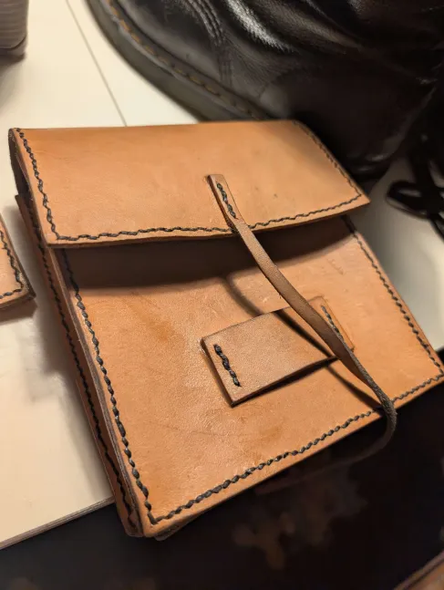

# I made a bag

A while ago I made a leather satchel, one that sits on my hip attached to my belt, it's design is inspired by 15th century European saddlebags. Constructed from veg tanned leather offcuts and waxed linen thread (alongside two brass grommets). I set out to construct this bag as an attempt to make a unique accessory that served a practical function for when i go to raves and parties. The bag has since become a part of my daily attire due to the practicality of it.

